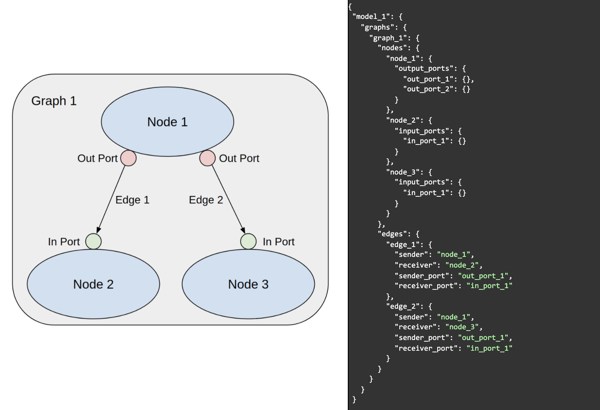
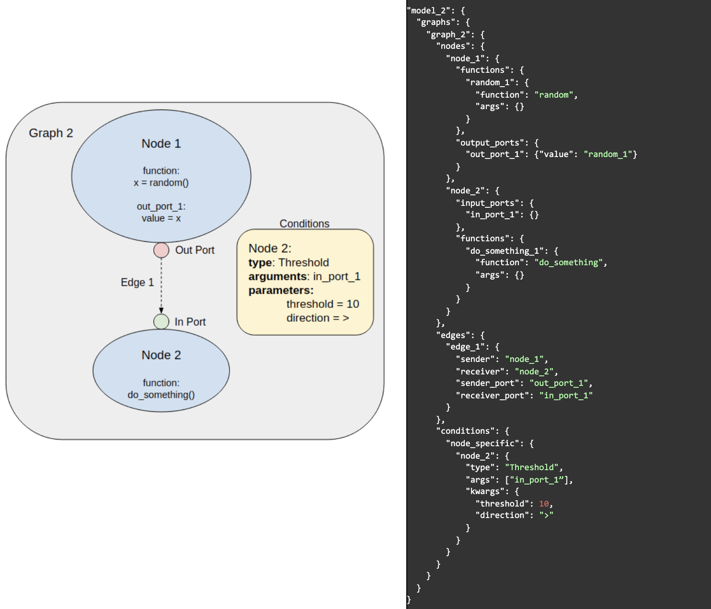

  

[![Actions Status][actions-badge]][actions-link]

# ModECI Model Description Format (MDF)
**Note: MDF is still in development! See the [open issues related to the specification](https://github.com/ModECI/MDF/issues?q=is%3Aissue+is%3Aopen+label%3Aspecification) or go [here](http://modeci.org/#aboutPage) to get in contact regarding MDF.**
*The MDF format was first proposed following a meeting organised at Princeton in July 2019 by Russ Poldrack of the Center for Reproducible Neuroscience (CRN) at Stanford and the [Brain Imaging Data Standard (BIDS)](https://bids.neuroimaging.io/) initiative. For more on the previous work in this area, see [here](https://github.com/OpenSourceBrain/PsyNeuLinkShowcase/tree/master/BIDS-MDF).*

## Overview

MDF is intended to be an open source, community-supported standard and associated library of tools for expressing computational models in a form that allows them to be exchanged between diverse programming languages and execution environments. It consists of a specification for expressing models in a serialized format (currently a JSON representation, though others such as YAML and HDF5 are planned) and a set of Python tools for implementing a model described using MDF. The serialized format can be used when importing a model into a supported target environment to execute it; and, conversely, when exporting a model built in a supported environment so that it can be re-used in other environments.

The MDF Python API can be used to create or load an MDF model for inspection and validation. It also includes a basic scheduler for simulating models in the format. However, this is not intended as a general purpose simulation environment, nor is MDF intended as a programming language.  Rather, the primary purpose of the Python API is  to facilitate and validate the exchange of models between existing environments that serve different communities.  Accordingly, these Python tools include bi-directional support for importing to and exporting from widely-used programming environments in a range of disciplines, and for easily extending these to other environments.

## Development

The implementation and dissemination of the MDF language and associated tools is being carried out by the [Model Exchange and Convergence Initiative (ModECI)](http://modeci.org/), with support from the [NSF Convergence Accelerator Program](https://www.nsf.gov/od/oia/convergence-accelerator/) (Track D: AI-Driven Innovation via Data and Model Sharing), as a publicly accessible open source project. The initial design has been informed by a series of workshops involving developers of key software environments and other stakeholders in machine learning, cognitive science and neuroscience. Future workshops will address broadening of support to other domains in basic and applied science and technology development (e.g., population biology, medical informatics, structural and environmental monitoring, and complex systems control).  Environments for which support is currently being developed include [PyTorch](https://pytorch.org), [ONNX](http://onnx.ai), [WebGME](https://webgme.org), [NeuroML](https://neuroml.org), [PsyNeuLink](http://www.psyneuln.deptcpanel.princeton.edu), and [ACT-R](http://act-r.psy.cmu.edu).

  
 <i><b>Fig 1:</b> Some of the current and planned formats which MDF will interact with. Click on the image for more information.</i>

Successful interfacing of MDF to existing disciplinary standards (such as [ONNX](http://onnx.ai) in machine learning, and [NeuroML](https://neuroml.org) in neuroscience) as well as general purpose simulation environments (such as [WebGME](https://webgme.org)) will permit bridging between these environments, and translation to the broader set of environments supported by those standards (such as [Tensorflow](https://www.tensorflow.org) & [Keras](https://keras.io) in the case of ONNX, and [The Virtual Brain](https://www.thevirtualbrain.org) and [SONATA](https://github.com/AllenInstitute/sonata) in the case of NeuroML).  Efforts are also underway, in collaboration with projects in the NSF Accelerator Track C (Quantum Technology), to use MDF for facilitating the implementation of computational models on [quantum hardware](https://github.com/ModECI/MDF/blob/readme_update/examples/Quantum).

### The core elements of the MDF standard

**[Models](https://github.com/ModECI/MDF/blob/main/docs/README.md#model)** The highest level construct in MDF is a model that consists of one or more graphs and model attributes.  The former describe the operational features of the model (its structure and execution), while the latter provide additional information useful for executing and evaluating it (e.g., test data and benchmark results).

**[Graphs](https://github.com/ModECI/MDF/blob/main/docs/README.md#graph)** A graph specifies the structure and process flow of a model. The most fundamental element of a graph is a node, which specifies some unit of computation as one or more functions. Functions reference executable implementations in a standardized ontology (with bindings to well-established existing ontologies, such as ONNX, where available). Nodes are connected to other nodes via directed edges, which, in the absence of additional conditions, define the computational flow of the model.

**[Nodes](https://github.com/ModECI/MDF/blob/main/docs/README.md#node)** These define the core elements of computation in a graph, that receive and transmit information via their input ports and output ports.  The latter are the points of contact between a node and the edges that connect it to other nodes.  Nodes can also recursively specify sub-graphs, provided the subgraphs are also valid MDF graphs.

**[Edges](https://github.com/ModECI/MDF/blob/main/docs/README.md#edge)**  These transmit information from the output port of one node to the input port of another, collectively defining a graph’s topography. Edges may contain weights that can operate on the information they carry.

**[Conditions](https://github.com/ModECI/MDF/blob/main/docs/README.md#condition)** These are a core and distinctive element of the MDF specification, that complement other computational graph-based formats by providing a high-level set of descriptors for specifying conditional execution of nodes. This allows models with relatively complex execution requirements (e.g., containing cycles, branches, and/or temporal dependencies) to be expressed as graphs in a sufficiently abstract form that facilities exchange among high-level modeling environments without requiring that they be “lowered” to and then recovered from more elaborated procedural descriptions.

**[Parameters and Arguments](https://github.com/ModECI/MDF/blob/main/docs/README.md#node)**  Attributes that determine the configuration and operation of nodes and edges, such as function parameters and weight matrices, can be defined in the MDF using parameters. In the case of parameters specifying large data structures (e.g., weight-matrices), arrays in widely used formats (e.g. numpy arrays) can be used, and serialisation in portable binary formats (e.g. HDF5) will be supported.. Functions can have dynamically-set attributes in the form of arguments, often sourced from an input port on the node containing that function.  Conditions may use arguments which are both static and dynamic. For example, a threshold condition may compare a dynamically-changing value, passed as an argument, against a static threshold parameter.

**[States](https://github.com/ModECI/MDF/blob/main/docs/README.md#state)**  For information that must persist between executions of a node (such as integrator functions), MDF nodes support states, which can be modified and accessed on a given execution, and will persist and be available in subsequent executions.

**[Model Attributes](https://github.com/ModECI/MDF/blob/main/docs/README.md#model)**  These provide for the definition of model “meta-data,” including contact information, citations, acknowledgements, pointers to sample data and benchmark results, and environments in which the specified model was originally implemented and any that have been validated to support its execution.

 <i><b>Fig 2:</b> A simple graph with 3 nodes and 2 edges expressed in MDF.</i>

 <i><b>Fig 3:</b> This graph illustrates the ability to specify behavior that extends beyond the directed flow through the graph. Here, Node 1 generates a random number and transmits that number to Node 2. Node 2 will only run if the number it receives from Node 1 is greater than 10.</i>

## Examples

Multiple examples of serialized MDF files, the Python scripts used to generate them, as well as mappings to target environments can be found [here](https://github.com/ModECI/MDF/blob/main/examples/README.md).

[actions-badge]:            https://github.com/ModECI/MDF/actions/workflows/ci.yml/badge.svg
[actions-link]:             https://github.com/ModECI/MDF/actions
