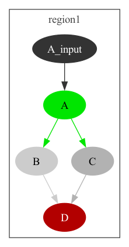
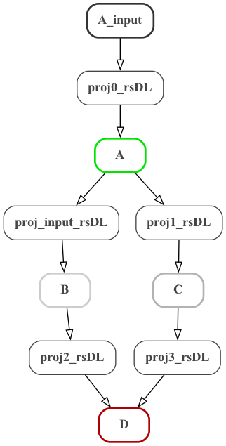
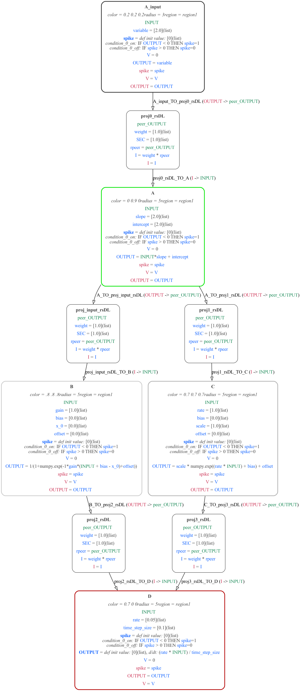
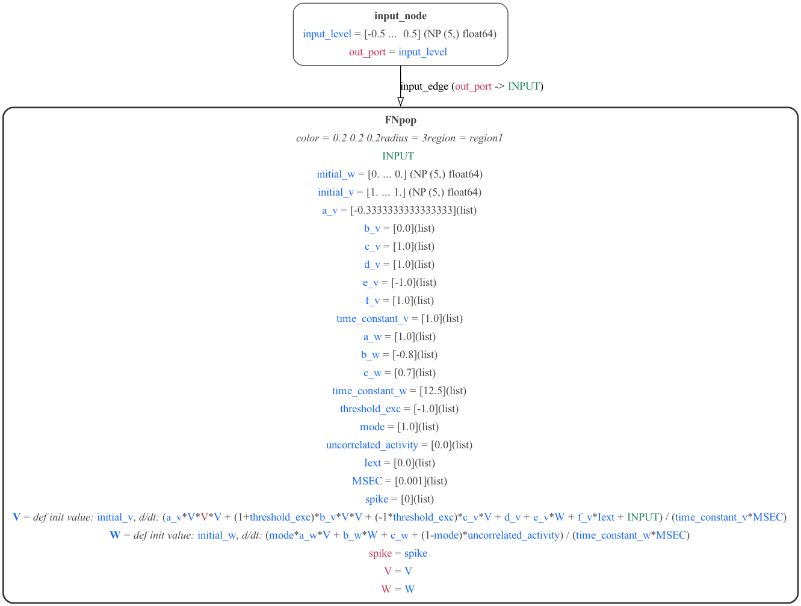
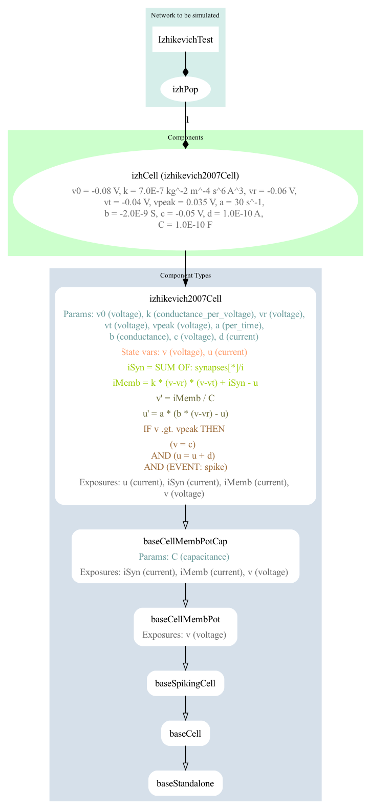
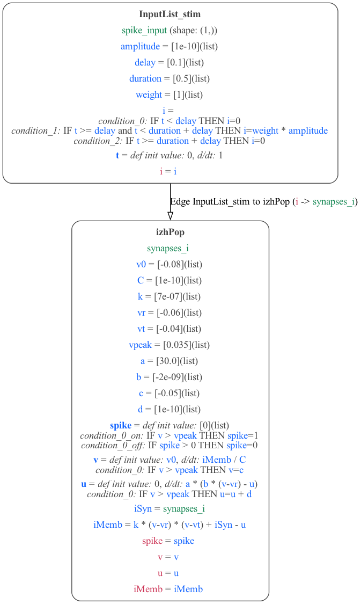

# Interactions between NeuroML and MDF

## 1) Converting NeuroML to MDF

## 1.1) Simple ABCD model

**Summary: A model is created in NeuroML (using cell dynamics specified in LEMS and a network in NeuroMLlite) and converted to the equivalent model in MDF, which runs with the reference MDF execution engine.**

### 1.1.1) ABCD - NeuroMLlite version

[ABCD.py](ABCD.py) is a script using the [NeuroMLlite](https://docs.neuroml.org/Userdocs/Software/NeuroMLlite.html) package to create a simple network with 4 connected elements. The network built can be seen below (this can be generated with `python ABCD.py -graph2`):



### 1.1.2) ABCD - NeuroML2 version

A version of the network in NeuroML 2 can be generated with `python ABCD.py -nml`, or generated and executed with jNeuroML with `python ABCD.py -nml`.
This will produce the NeuroML file: [ABCD.net.nml](ABCD.net.nml) (note though this is not valid, as not all the elements included are pure NeuroML). A [LEMS Simulation file](https://docs.neuroml.org/Userdocs/LEMSSimulation.html) is generated for running the model in jNeuroML or pyNeuroML: [LEMS_SimABCD.xml](LEMS_SimABCD.xml)

The definitions of the components used for A, B, etc. can be found in [PNL.xml](PNL.xml). This is a set of definitions of component types based on those present in PsyNeuLink. A graph depicting the definitions of the network elements can be generated with `pynml LEMS_SimABCD.xml -lems-graph`:


### 1.1.3) ABCD - MDF version

A version of the network in MDF can be generated from NeuroMLlite definition with: `python ABCD.py -mdf` producing [ABCD.mdf.yaml](ABCD.mdf.yaml) and [ABCD.mdf.json](ABCD.mdf.json).

A graph of the structure of the MDF model can be generated with: `python -m modeci_mdf.interfaces.graphviz.exporter ABCD.mdf.yaml 1` (left below), or with more detail: `python -m modeci_mdf.interfaces.graphviz.exporter ABCD.mdf.yaml 3` (right below.)





## 1.2) FitzHugh Nagumo cell models

### 1.2.1) FN - NeuroML version

A version of the FitzHugh Nagumo neuron model has been created using NeuroMLlite ([FN.py](FN.py)) which generated LEMS ([LEMS_SimFN.xml](LEMS_SimFN.xml)) which can simulate the NeuroML model ([FN.net.nml](FN.net.nml)).

A graphical representation of the LEMS is below:


It can be run with:
```
python FN.py -jnml      # Generate and run the LEMS file from the NeuroMLlite description
pynml LEMS_SimFN.xml    # Run the LEMS file using pyNeuroML
```


### 1.2.2) FN - MDF version

The NeuroMLlite version can also be used to generate MDF for the model:

```
python FN.py -mdf      # Generate the MDF serializations (JSON and YAML) from the NeuroMLlite description
```

These can be seen here: [FN.mdf.json](FN.mdf.json), [FN.mdf.yaml](FN.mdf.yaml), and a graphical version generated with:

```
python -m modeci_mdf.interfaces.graphviz.importer FN.mdf.yaml 3    #  Generate graph from MDF version
```


### 1.2.3) FN - Execute model using MDF

A script has been created ([FNrun.py](FNrun.py)) where the model is loaded, run using the standard MDF execution engine, and plotted:

```
python FNrun.py    # Load FN model and run with MDF scheduler
```


Adding the option `-multi` to the Python script for running the FN example, modifies the graph to add an input node with an array of values, meaning multiple instances of the FN neuron will be simulated:

```
python FN.py -multi
```




## 1.3) Izhikevich cell models

A version of the Izhikevich spiking neuron model has been created in NeuroML and can be exported to MDF and executed with the standard execution engine.

### 1.3.1) Izhikevich - NeuroML version

The single cell model has been created using NeuroMLlite ([Izhikevich.py](Izhikevich.py)) which generated LEMS ([LEMS_SimIzhikevichTest.xml](LEMS_SimIzhikevichTest.xml)) which can simulate the NeuroML model ([IzhikevichTest.net.nml](IzhikevichTest.net.nml)).

A graphical representation of the LEMS is below:



It can be run with:
```
python Izhikevich.py -jnml      # Generate and run the LEMS file from the NeuroMLlite description
pynml LEMS_SimIzhikevichTest.xml    # Run the LEMS file using pyNeuroML
```

### 1.3.2) Izhikevich - MDF version

The NeuroMLlite version can also be used to generate MDF for the model:

```
python Izhikevich.py -mdf      # Generate the MDF serializations (JSON and YAML) from the NeuroMLlite description
```

These can be seen here: [IzhikevichTest.mdf.json](IzhikevichTest.mdf.json), [IzhikevichTest.mdf.yaml](IzhikevichTest.mdf.yaml), and a graphical version generated with:

```
python -m modeci_mdf.interfaces.graphviz.importer IzhikevichTest.mdf.yaml 3    #  Generate graph from MDF version
```



### 1.3.3) Izhikevich - Execute model using MDF

A script has been created ([Izh_run.py](Izh_run.py)) where the model is loaded, run using the standard MDF execution engine, and plotted:

```
python Izh_run.py    # Load Izh model and run with MDF scheduler
```


## 2) Converting MDF to NeuroML/LEMS


It is also possible to convert MDF models into equivalents in NeuroML/LEMS:

```
cd ../MDF  # convert some of the examples in the examples/MDF directory

python -m modeci_mdf.interfaces.neuroml.exporter Simple.json -run
python -m modeci_mdf.interfaces.neuroml.exporter ABCD.json -run
python -m modeci_mdf.interfaces.neuroml.exporter States.json -run
```
