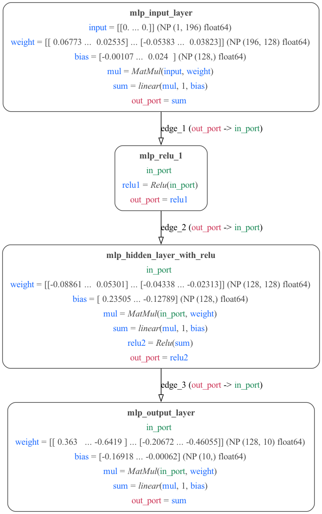
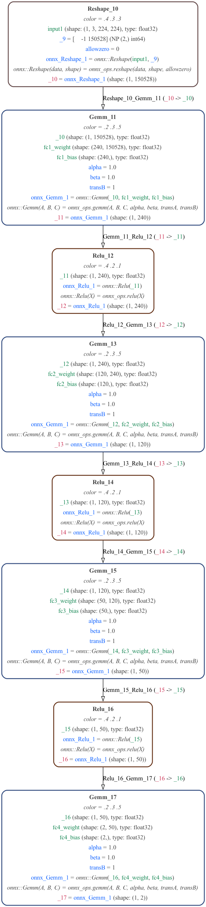
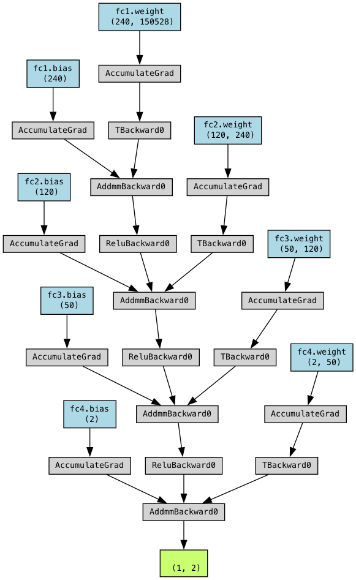
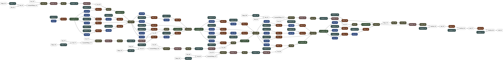
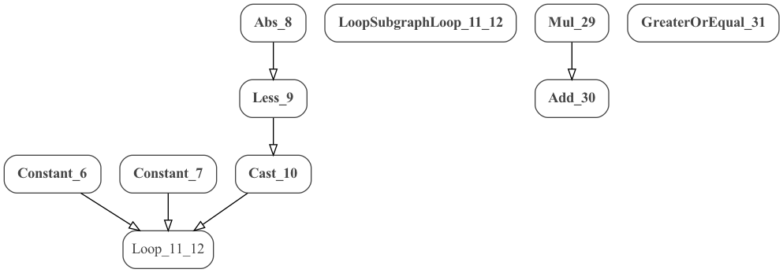

# PyTorch and MDF

Models can be created in [PyTorch](http://www.pytorch.org) and exported into MDF format, or MDF models can be converted to code which executes natively in PyTorch.

## MDF to PyTorch

To export an MDF model to PyTorch, provide an MDF model as an input to the [mdf_to_pytorch()](https://mdf.readthedocs.io/en/latest/api/_autosummary/modeci_mdf.interfaces.pytorch.exporter.mdf_to_pytorch.html#modeci_mdf.interfaces.pytorch.exporter.mdf_to_pytorch) function.

The output of `mdf_to_pytorch` is a PyTorch model.

```
mdf_to_pytorch(
      mdf_model: model in MDF format
      eval_models: Set Evaluation of model to True or False
      version: MDF version
      model_input: input file name
)
```

It returns a dictionary where `key` = `model name` and `value` = `PyTorch model object`.

A test script demonstrating conversion of MDF model to PyTorch is at [MDF_to_PyTorch.py](/examples/PyTorch/MDF_PyTorch/MDF_to_PyTorch.py). This converts multiple MDF models to their respective PyTorch models. The converted models are available in folder: [MDF_PyTorch](/examples/PyTorch/MDF_PyTorch).

### Examples

Below are some working examples of this functionality.

#### 1) Simple ABCD example

We convert one of the sample MDF examples [ABCD.json](../MDF/ABCD.json):


This is converted to PyTorch and can be seen here: [ABCD_pytorch.py](MDF_PyTorch/ABCD_pytorch.py).

The PyTorch model is further converted to ONNX [ABCD.onnx](MDF_PyTorch/ABCD.onnx). An image of the contents of the ONNX model (visualized using [NETRON](https://netron.app/)) is below.


<!-- this representation was produced from https://netron.app/ by uploading the ONNX model and exporting the svg-->

#### 2) Multi-Layer Perceptron MDF to PyTorch Conversion:

  To run an example where a simple Multi-Layer Perceptron (MLP) created using the MDF specification and executed using sample digit-recognition data, run:

  ```bash
  python mlp_pure_mdf.py
  ```

A graph of the network can be created with `python mlp_pure_mdf.py -graph`:

  

The network can be run against images from the MNIST database with: `python mlp_pure_mdf.py -run`, and produce 98% accuracy. The image below shows the results of 300 images:

  


## PyTorch to MDF

The current implementation of our PyTorch to MDF conversion functionality is built
on top of the TorchScript infrastructure provided by PyTorch. PyTorch models that
can be translated to TorchScript (via `torch.jit.script` or `torch.jit.trace`) should
then be able to be converted to their MDF representation automatically. Below are
several working examples of this functionality.

To perform an PyTorch to MDF conversion, provide a PyTorch model as an input to the [pytorch_to_mdf()](https://mdf.readthedocs.io/en/latest/api/_autosummary/modeci_mdf.interfaces.pytorch.importer.pytorch_to_mdf.html#modeci_mdf.interfaces.pytorch.importer.pytorch_to_mdf) function
which is available in [importer.py](/src/modeci_mdf/interfaces/pytorch/importer.py). The output of `pytorch_to_mdf()` is an MDF model.

```
pytorch_to_mdf(
      model: The model to translate into MDF.
      args: The input arguments for this model. If a nn.Module is passed then the model will be traced with these
          inputs. If a ScriptModule is passed, they are still needed to deterimine input shapes.
      trace: Force the use of tracing to compile the model. The default is to use torch.jit.script
      use_onnx_ops: Use ONNX ops when possible, fallback to ATEN ops when not available. Default is True. If False,
          use only ATEN ops.
)
```
Returns a translated MDF model.

### Examples of usage

#### 1) Simple PyTorch To MDF

This is a simple fully-connected neural network model example consisting of input image of 224 * 224 * 3 and resulting in two classes as the output
  To run an example of converting a PyTorch model written in PyTorch to its MDF representation simply run:

  ```bash
  python simple_pytorch_to_mdf.py
  ```
  Code is present in [simple_pytorch_to_mdf.py](simple_pytorch_to_mdf.py)
  The graph representation of the ONNX model can be generated with:
  ```bash
  python simple_pytorch_to_mdf.py -graph-onnx
  ```

  


  **NOTE**: This command will run the NETRON python server on the local host where we can export the graph as svg/png

  The graph representation of the MDF model can be generated with:
  ```bash
  python simple_pytorch_to_mdf.py -graph
  ```

Graphical export from MDF level 1:


Graphical export from MDF level 3:



To visualize the PyTorch model:
  ```bash
  python simple_pytorch_to_mdf.py -graph-torch
  ```



The MDF for this model is the written to [simple_pytorch_to_mdf.json](simple_pytorch_to_mdf.json). The model is then executed
via the MDF scheduler and the results are compared to the native execution in PyTorch.

#### 2) Inception Blocks Model

  
  To run an example of converting a PyTorch InceptionV3 like model written in PyTorch to its MDF representation simply run:

  ```bash
  python inception.py
  ```
  Code is present in [inception.py](inception.py)
  This will define the model in PyTorch, invoke the TorchScript tracing compiler,
  convert the underlying IR representation of the model to MDF. The MDF for this
  model is the written to [inception.json](inception.json). The model is then executed
  via the MDF scheduler and the results are compared to the native execution in PyTorch.

  The graph representation of the MDF model can be generated with:

  ```bash
  python inception.py -graph
  ```



<!--  Not yet working !
3. A DDM A model that simulates a simple noisy drift diffusion model using Euler-Maruyama integration. This is implemented without performance in mind. [pytorch_ddm.py](pytorch_ddm.py) is converted to [ddm.json](ddm.json)

    <p align="center"></p>
    Conversion to MDF: TODO...
-->
