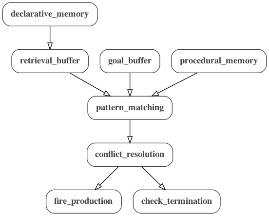

# Interactions between MDF and ACT-R

This directory contains examples of ACT-R models converted to MDF. The ACT-R
models [count.lisp](count.lisp) and [addition.lisp](addition.lisp) are based on 
the [ACT-R tutorial](http://act-r.psy.cmu.edu/software/).

The scripts [count.py](count.py) and [addition.py](addition.py) can be run
to create the MDF .json and .yaml files for the given example and execute it
using the MDF scheduler.

The below graph represents the basic structure of all ACT-R models in MDF:

There are also more detailed graphs [count.png](count.png) and 
[addition.png](addition.png) for each example.

### Count Model

[ACT-R](count.lisp) | [JSON](count.json) | [YAML](count.yaml) | [Python Script](count.py) | [Graph](count.png)

The count model counts from a start value to an end value. The script 
[count.py](count.py) first reads the original ACT-R model file 
[count.lisp](count.lisp), generates an MDF representation using the MDF ACT-R interface, and outputs the [JSON](count.json) and [YAML](count.yaml) files. It then executes 
the MDF model using the MDF scheduler and outputs the final goal set by the 
model once execution is finished. The final goal has the form:

`{'name': 'first-goal', 'ISA': 'count-from', 'start': 'two', 'end': 'four', 'count': 'four'}`

In this example, the start value is two, the end value is four, and the final
value of count is four, indicating that the model counted from two to four. The
start and end values can be modified in line 17 of [count.lisp](count.lisp),
which sets the initial goal of the model:

`(first-goal ISA count-from start two end four)`

The script can use any values specified in [count.lisp](count.lisp), so the 
model can be modified and run multiple times in order to test different values. 
The [count](count.png) graph represents this example.

### Addition Model

[ACT-R](addition.lisp) | [JSON](addition.json) | [YAML](addition.yaml) | [Python Script](addition.py) | [Graph](addition.png)

The addition model computes the sum of two numbers. The script 
[addition.py](addition.py) functions identically to the previous example, but 
uses the addition model instead. The final goal has the form:

`{'name': 'second-goal', 'ISA': 'add', 'arg1': 'five', 'arg2': 'two', 'sum': 'seven', 'count': 'nil'}`

In this case, the first argument is five, the second argument is two, and the
model has calculated the sum, seven. Like the previous example, the arguments 
can be modified in line 23 of [addition.lisp](addition.lisp) in order to test
different values:

`(second-goal ISA add arg1 five arg2 two)`

The [addition](addition.png) graph represents this example.