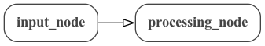
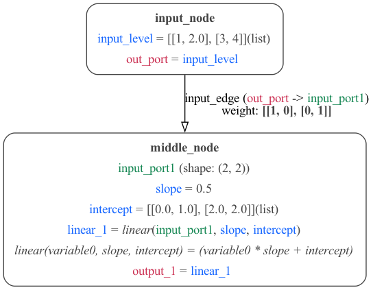

# MDF Examples

[Simple](#simple-example) | [ABCD](#abcd) | [Arrays](#arrays) | [States](#states) | [Conditions](#conditions) | [Parameters and Functions](#parameters-and-functions)

## Simple example

[Python source](simple.py) | [JSON](Simple.json) | [YAML](Simple.yaml)

A simple example with 2 [Nodes](https://mdf.readthedocs.io/en/latest/api/Specification.html#node) connected by an [Edge](https://mdf.readthedocs.io/en/latest/api/Specification.html#edge):

With more detail on [Nodes](https://mdf.readthedocs.io/en/latest/api/Specification.html#node) (showing [Input Ports](https://mdf.readthedocs.io/en/latest/api/Specification.html#inputport) (green), [Parameters](https://mdf.readthedocs.io/en/latest/api/Specification.html#parameter) (blue) and [Output Ports](https://mdf.readthedocs.io/en/latest/api/Specification.html#output_port)) (red) and [Edges](https://mdf.readthedocs.io/en/latest/api/Specification.html#edge):

 

## ABCD

[Python source](abcd.py) | [JSON](ABCD.json) | [YAML](ABCD.yaml)

Another simple example with more [Nodes](https://mdf.readthedocs.io/en/latest/api/Specification.html#node).

 &nbsp; 

## Arrays

[Python source](arrays.py) | [JSON](Arrays.json) | [YAML](Arrays.yaml)

An example using arrays for [Parameters](https://mdf.readthedocs.io/en/latest/api/Specification.html#parameter) and weights on [Edges](https://mdf.readthedocs.io/en/latest/api/Specification.html#edge).

## States

[Python source](states.py) | [JSON](States.json) | [YAML](States.yaml)

An example with [Nodes](https://mdf.readthedocs.io/en/latest/api/Specification.html#node) containing persistent [States](https://mdf.readthedocs.io/en/latest/api/Specification.html#state).

## Conditions

[Python source](abc_conditions.py) | [JSON](abc_conditions.json) | [YAML](abc_conditions.yaml)

A simple 3 [Nodes](https://mdf.readthedocs.io/en/latest/api/Specification.html#node) graph with scheduling [Conditions](https://mdf.readthedocs.io/en/latest/api/Specification.html#condition). For more examples of conditions see [here](conditions/README.md).

## Parameters and Functions

[Python source](params_funcs.py) | [JSON](ParametersFunctions.json) | [YAML](ParametersFunctions.yaml)

A simple [Node](https://mdf.readthedocs.io/en/latest/api/Specification.html#node) with a number of different types of [Parameters](https://mdf.readthedocs.io/en/latest/api/Specification.html#parameter) (in blue; fixed and **stateful**) and [Functions](https://mdf.readthedocs.io/en/latest/api/Specification.html#function) (in purple; can be built in or ONNX based).

## More examples

There are further examples under development, including of a Recurrent Neural Network (RNN), and an Integrate and Fire (IaF) neuron model in [this directory](RNN).
