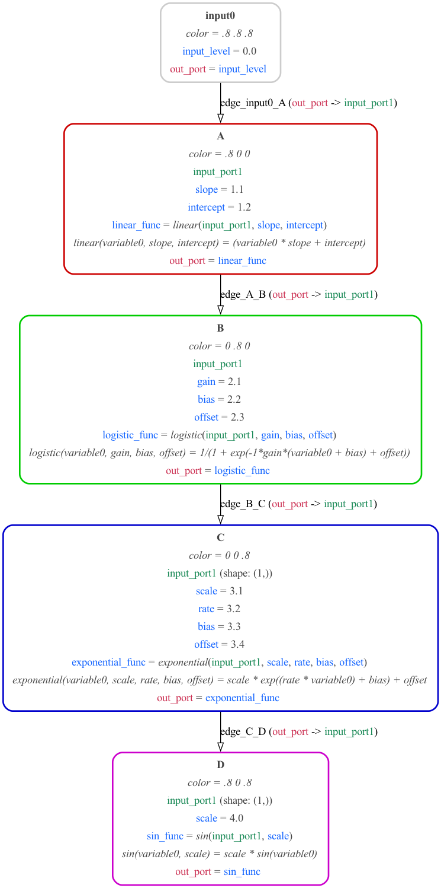
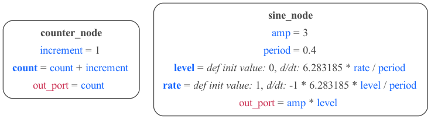
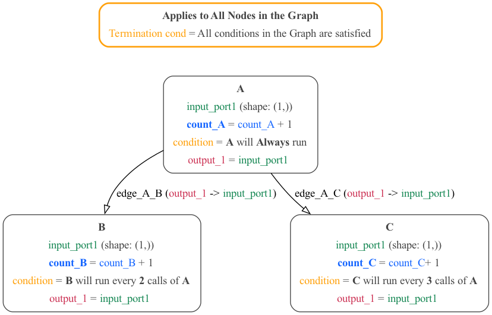

# MDF Examples

Examples of Python, JSON and YAML files to illustrate the structure and usage of MDF.

[Simple](#simple) | [ABCD](#abcd) | [Arrays](#arrays) | [States](#states) | [Conditions](#conditions)

## Simple example

[Python source](simple.py) | [JSON](Simple.json) | [YAML](Simple.yaml)

A simple example with 2 [Nodes](../../docs/README.md#node) connected by an [Edge](../../docs/README.md#edge):

With more detail on [Nodes](../../docs/README.md#node) (showing [Parameters](../../docs/README.md#parameter),
 [Functions](../../docs/README.md#function), [Input Ports](../../docs/README.md#inputport) and [Output Ports](../../docs/README.md#output_port)) and [Edges](../../docs/README.md#edge):

## ABCD

[Python source](abcd.py) | [JSON](ABCD.json) | [YAML](ABCD.yaml)

Another simple example with more [Nodes](../../docs/README.md#node).

## Arrays

[Python source](arrays.py) | [JSON](Arrays.json) | [YAML](Arrays.yaml)

An example using arrays for [Parameters](../../docs/README.md#parameter) and weights on [Edges](../../docs/README.md#edge).

## States

[Python source](states.py) | [JSON](States.json) | [YAML](States.yaml)

An example with [Nodes](../../docs/README.md#node) containing persistent [States](../../docs/README.md#state).

## Conditions example

[Python source](abc_conditions.py) | [JSON](abc_conditions.json) | [YAML](abc_conditions.yaml)

A simple 3 [Nodes](../../docs/README.md#node) graph with scheduling [Conditions](../../docs/README.md#condition)

