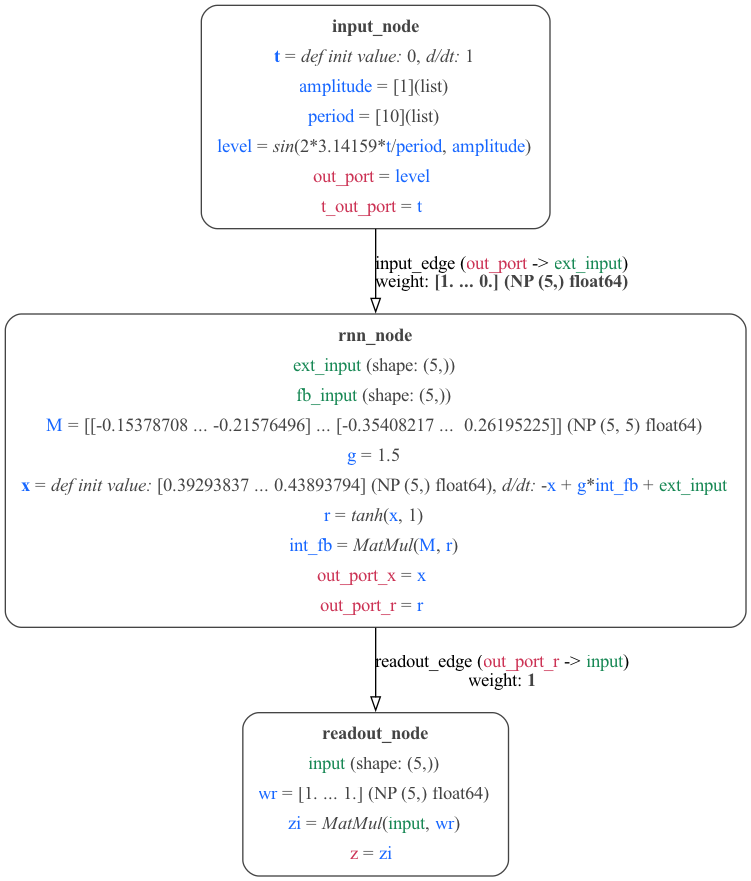
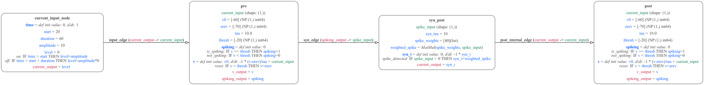
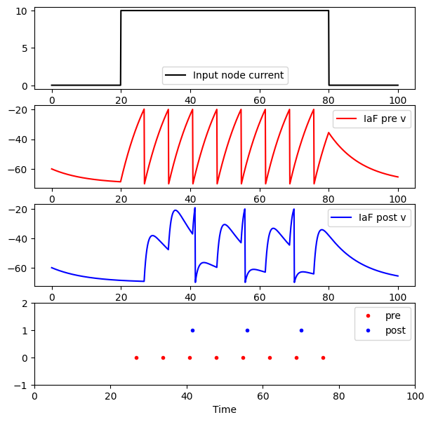

**These examples are work in progress!**

## Recurrent Neural Network (RNN) model

The script [generate_rnn.py](generate_rnn.py) can be used to generate an example RNN model. The MDF is in [RNNs.yaml](RNNs.yaml) and `python generate_rnn.py -graph` will produce the following graph of the network:

To run the network using the MDF execution engine type `python generate_rnn.py -run`, producing:

## Integrate and Fire (IaF) neuron model

The script [generate_iaf.py](generate_iaf.py) can be used to generate an example Integrate and Fire model. The MDF is in [IAFs.yaml](IAFs.yaml) and `python generate_iaf.py -graph` will produce the following graph of the network:

To run the network using the MDF execution engine type `python generate_iaf.py -run`, producing:

