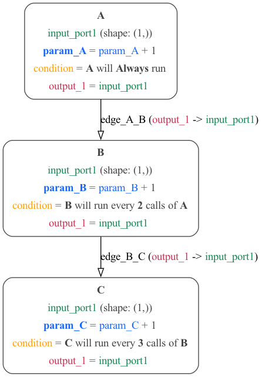

# Conditions in MDF

In MDF, Conditions are used to specify how many times and when individual nodes are allowed to be executed. There are different types of conditions which are categorized into five and they includes:

**Generic Condition** - This is satisfied when a user-specified function and set of arguments evaluates to **True**, They are also used for calling [custom conditions](https://kmantel.github.io/graph-scheduler/Condition.html#condition-custom). Examples of Conditions that are categorized under Generic condition can be found [here](https://kmantel.github.io/graph-scheduler/Condition.html#conditions-generic). see [here](https://github.com/ModECI/MDF/blob/main/examples/MDF/conditions/threshold.py) for generic condition example in MDF.

**Static Condition** - This condition is satisfied either always or never and they are independent of other Conditions, nodes or time. Example of the used of a static condition in MDF can be found [here](https://github.com/ModECI/MDF/blob/main/examples/MDF/conditions/everyNCalls.py). Conditions that are categorized as static can be found [here](https://kmantel.github.io/graph-scheduler/Condition.html#conditions-static)

**Composite Condition** - This condition is dependent on another condition(s) and it is satisfied based on the condition it is dependent on. Conditions that are categorized as composite can be found [here](https://kmantel.github.io/graph-scheduler/Condition.html#conditions-composite)

**Time-based Condition** - This condition is satisfied based on the current count of units of time at a specified TimeScale. Conditions that are categorized as time based can be found [here](https://kmantel.github.io/graph-scheduler/Condition.html#conditions-time-based). See time-based condition use in MDF [here](https://github.com/ModECI/MDF/blob/main/examples/MDF/conditions/timeInterval.py)

**Node-based Condition**- This condition is based on the execution or state of other nodes. Conditions that are categorized as node based can be found [here](https://kmantel.github.io/graph-scheduler/Condition.html#conditions-node-based). Example the use of a node based condition in MDF can be found [here](https://github.com/ModECI/MDF/blob/main/examples/MDF/conditions/everyNCalls.py)

**Convenience Condition** - This condition is based on other Conditions, condensed for convenience. Conditions that are categorized as convenience can be found [here](https://kmantel.github.io/graph-scheduler/Condition.html#conditions-convenience)

These different category of conditions can be used interchangeably for different nodes in a graphs (e.g if there are two nodes in a graph Static conditions can be used for the first node and Time based condition can be used for the second node) Likewise, a condition category  can also be used for different nodes in a graph(e.g if there are two nodes in a graph, Node based conditions can be used for the two nodes). To read more about conditions in MDF see [here](https://kmantel.github.io/graph-scheduler/Condition.html)

## Conditions Examples

These are some graphical examples illustrating the different applications of different categories of conditions in MDF.

Examples of Python, JSON and YAML files illustrating the use of conditions in MDF.

[Threshold](#threshold-example) | [Time Interval](#time-interval-example) | [EveryNCalls](#everyncalls-example)
### Generic condition example

[Python source](threshold.py)  | [JSON](threshold_condition.json) | [YAML](threshold_condition.yaml)

A simple example with 1 [Node](../../../docs/README.md#node)

###  Static and Node based conditions Examples

[Python source](everyNCalls.py) | [JSON](everyncalls_condition.json) | [YAML](everyncalls_condition.yaml)

Another simple example with 3 [Nodes](../../../docs/README.md#node).

### Time Interval condition example

[Python source](timeInterval.py) | [JSON](timeinterval_condition.json) | [YAML](timeinterval_condition.yaml)

A simple 2 [Nodes](../../../docs/README.md#node) graph satisfying the [ Time Interval Conditions](https://kmantel.github.io/graph-scheduler/Condition.html#graph_scheduler.condition.TimeInterval)

