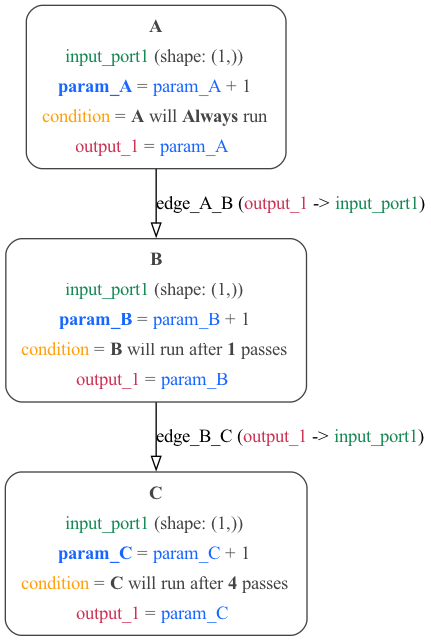
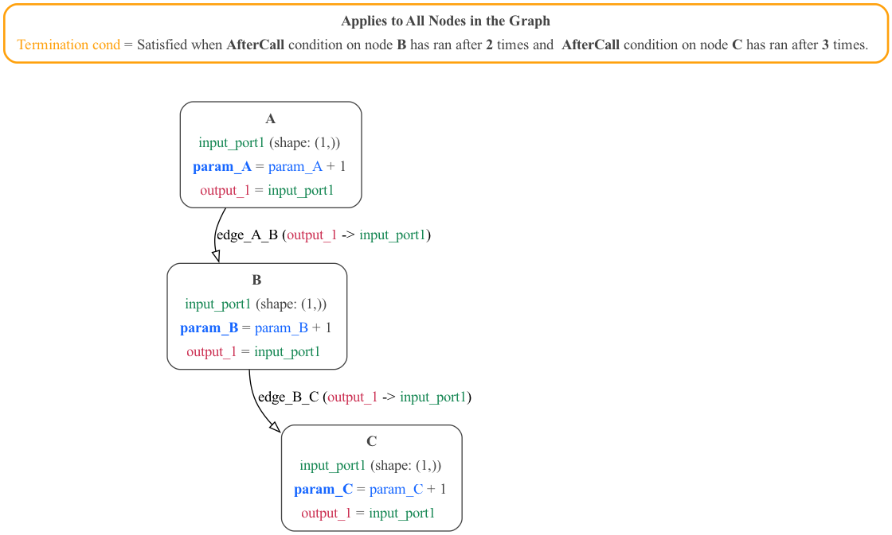

# Conditions in MDF

In MDF, Conditions are used to specify how many times and when individual nodes are allowed to be executed. MDF Conditions are created using the [Graph Scheduler library](https://github.com/kmantel/graph-scheduler), which is included as a [standard dependency of MDF](https://github.com/ModECI/MDF/blob/main/setup.cfg). There are different types of conditions which are categorized into six and they include:

**Generic Condition** - This is satisfied when a user-specified function and set of arguments evaluates to **True**, They are also used for calling [custom conditions](https://kmantel.github.io/graph-scheduler/Condition.html#condition-custom). Examples of Conditions that are categorized under Generic condition can be found [here](https://kmantel.github.io/graph-scheduler/Condition.html#conditions-generic). See [here](https://github.com/ModECI/MDF/blob/main/examples/MDF/conditions/threshold.py) for generic conditions examples in MDF.

**Static Condition** - This condition is satisfied as either always or never and they are independent of other Conditions, nodes or time. Example of the use of a static conditions in MDF can be found [here](https://github.com/ModECI/MDF/blob/main/examples/MDF/conditions/everyNCalls.py). Conditions that are categorized as static can be found [here](https://kmantel.github.io/graph-scheduler/Condition.html#conditions-static)

**Composite Condition** - This condition is dependent on another condition(s) and it is satisfied based on the condition it is dependent on. Conditions categorized as composite can be found [here](https://kmantel.github.io/graph-scheduler/Condition.html#conditions-composite). Example of the use of a composite conditions in MDF can be found [here](composite_condition_example)

**Time-based Condition** - This condition is satisfied based on the current count of units of time at a specified TimeScale. Conditions categorized as time based can be found [here](https://kmantel.github.io/graph-scheduler/Condition.html#conditions-time-based). See time-based conditions use in MDF [here](https://github.com/ModECI/MDF/blob/main/examples/MDF/conditions/timeInterval.py)

**Node-based Condition**- This condition is based on the execution or state of other nodes. Conditions categorized as node based can be found [here](https://kmantel.github.io/graph-scheduler/Condition.html#conditions-node-based). Example of node based conditions in MDF can be found [here](https://github.com/ModECI/MDF/blob/main/examples/MDF/conditions/everyNCalls.py)

**Convenience Condition** - This condition is based on other Conditions, condensed for convenience. Conditions categorized as convenience can be found [here](https://kmantel.github.io/graph-scheduler/Condition.html#conditions-convenience)

These different category of conditions can be used simultaneously for different nodes in a graphs (e.g if there are two nodes in a graph Static conditions can be used for the first node and Time based condition can be used for the second node). Likewise, a condition category can also be used for different nodes in a graph (e.g if there are two nodes in a graph, Node based conditions can be used for the two nodes). To read more about conditions in Graph Scheduler see [here](https://kmantel.github.io/graph-scheduler/Condition.html).

## Conditions Examples

These are some graphical examples (and associated Python, JSON and YAML files) illustrating the use of different categories of conditions in MDF.

[Threshold](#threshold-example) | [Time Interval](#time-interval-example) | [EveryNCalls](#everyncalls-example) | [Composite](#composite-example)

### Generic condition example

[Python source](threshold.py)  | [JSON](threshold_condition.json) | [YAML](threshold_condition.yaml)

A simple example with 1 [Node](../../../docs/README.md#node)

The Python script used for this example can be executed using the command `python threshold.py -run`.
The graph above can be generated with the command `python threshold.py -graph`.

**NOTE:** Looking at the graph above, the threshold condition is used to terminate the model when the comparison between the value of the parameter (**param_A**) and the threshold using the comparator evaluates to **TRUE**. For this condition to be satisfied, the graph node **A** must be run 5 times. This is because the threshold condition is set to be greater or equal to five which will make the order of executions of nodes to be: **(A, A, A, A, A)**. After which the output of **A** will be five and the condition will be satisfied and terminate.

###  Static and Node based conditions Examples

[Python source](everyNCalls.py) | [JSON](everyncalls_condition.json) | [YAML](everyncalls_condition.yaml)

Another simple example with 3 [Nodes](../../../docs/README.md#node).

The Python script used for this example can be executed using the command `python everyNCalls.py -run`.
The graph image can be generated using the command `python everyNCalls.py -graph`.

**NOTE:** Looking at the graph above, the conditions used in this case are node specific conditions. The first node **A** is not dependent on any node and the condition will always run, the second node **B** is dependent on the first node as it will only run after **A** has been run two times, it won't run if this condition is not satisfied. The third node **C** is dependent on the second node **B** as it will only run if the **B** node has ran three times. But because the B node is dependent on A node to run, the C node has to inherit the dependency of the B nodes, i.e the order of execution of this graph will be: **(A, A, B, A, A, B, A, A, B, C)**.

In simpler terms, **A** will always run, **B** will run only when **A** has been run two times **(A, A, B)**, **C** will only run when **B** has run for three times, so **(A, A, B, A, A, B, A, A, B, C)**.

### Time based condition example

[Python source](timeInterval.py) | [JSON](timeinterval_condition.json) | [YAML](timeinterval_condition.yaml)

A simple 2 [Nodes](../../../docs/README.md#node) graph satisfying the [ Time Interval Conditions](https://kmantel.github.io/graph-scheduler/Condition.html#graph_scheduler.condition.TimeInterval)

The Python script used for this example can be executed using `python timeInterval.py -run`.
The graph image can be generated using the command `python timeInterval.py -graph`.

**NOTE:** This example lets the conditions fully specify how many times a node gets executed, so unlike the other examples there is just one call to `evaluate()` on the graph in [timeInterval.py](timeInterval.py). In the graph above, node **A** gets excuted **Always**.
Node **B** has an **AfterPass** condition, specifying it will only run after the count of passes of the runnable nodes on the graph is greater than n=1.
Note the number of the pass on the first time is 0. Node **C** has an **AfterPass** condition with n=4. The sequence of execution is **(A, A, A, B, A, B, A, B, A, B, C)**. This can be understood as:

- **A** - pass 0, just A runs
- **A** - pass 1, just A runs
- **A, B** - pass 2, greater than n=1 for B, so B runs too
- **A, B** - pass 3, greater than n=1 for B, so B runs too
- **A, B** - pass 4, greater than n=1 for B, so B runs too
- **A, B, C** - pass 5, greater than n=4 for C, so C runs too

### Composite Condition Example

[Python Source](composite_condition_example.py) | [JSON](Composite_mdf_condition.json) | [YAML](Composite_mdf_condition.yaml)

A simple example with 3 [Nodes](../../../docs/README.md#node).

The Python script used for this example can be executed using the command `python composite_condition_example.py -run`.
The graph image can be generated using the command `python composite_condition_example.py -graph`.

**NOTE:** Looking at the graph above, the **All** condition is used to terminate the execution when all of the condition dependencies have been met. The dependency used in this graph is **AfterCall** which is set on the **B** node and **C** node. The AfterCall condition is satisfied when the n (the number of executions of dependency) has been surpassed e.g, if n=2, and the dependency is on **B**, the aftercall condition will be met when **B** has been run more than 2 times. **B** has an aftercall dependency of n=2 which makes **B** to run until it has surpassed the number of execution set. The order of execution for the B node will be **(A,B,C,A,B,C,A,B)**. Because **B** ran more than two times, therefore, condition had been met. The trial was not terminated, because not all conditions were met. The **C** node had an aftercall dependency of n=3 which will make **C** run until it had surpassed the number of execution. Therefore, the order of execution will be **(A,B,C,A,B,C,A,B,C,A,B,C)**. When **C** ran for more than 3 times, the condition will be met and the trial would terminate.
