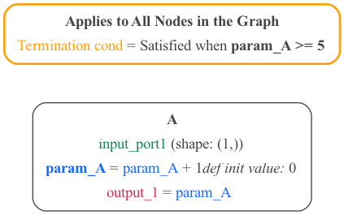

# Conditions Examples

A number of examples illustrating the use of conditions in MDF.

Examples of Python, JSON and YAML files illustrating the use of conditions in MDF.

[Threshold](#threshold-example) | [Time Interval](#time-interval-example) | [EveryNCalls](#everyncalls-example)
## Threshold example

[Python source](threshold.py)  | [JSON](threshold_condition.json) | [YAML](threshold_condition.yaml)

A simple example with 1 [Node](../../../docs/README.md#node)

## EveryNCalls example

[Python source](everyNCalls.py) | [JSON](everyncalls_condition.json) | [YAML](everyncalls_condition.yaml)

Another simple example with 3 [Nodes](../../../docs/README.md#node).

## Time Interval example

[Python source](timeInterval.py) | [JSON](timeinterval_condition.json) | [YAML](timeinterval_condition.yaml)

A simple 2 [Nodes](h../../../docs/README.md#node) graph satisfying the [ Time Interval Conditions](https://kmantel.github.io/graph-scheduler/Condition.html#graph_scheduler.condition.TimeInterval)

