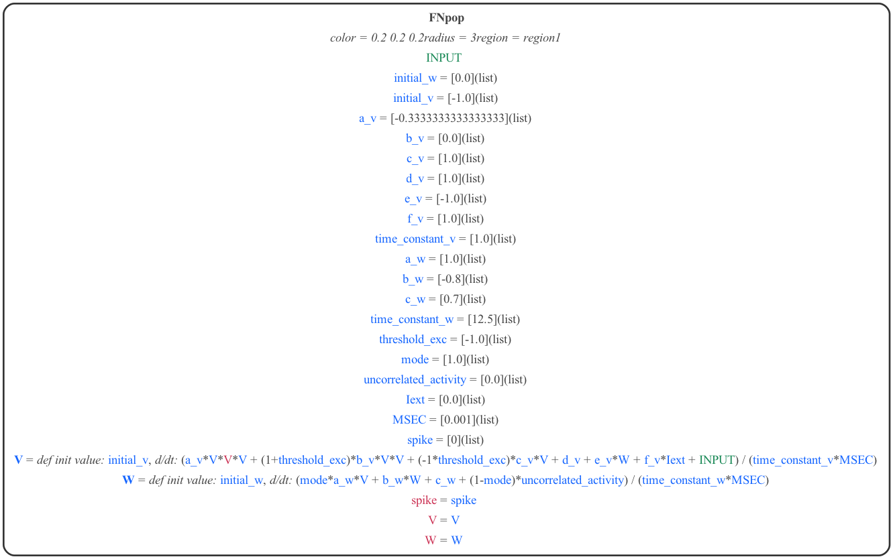

# Interactions between NeuroML and MDF

## FitzHugh Nagumo cell models

### NeuroML version

A version of the FitzHugh Nagumo neuron model has been specified in LEMS ([LEMS_SimFN.xml](LEMS_SimFN.xml)) for use in NeuroML ([FN.net.nml](FN.net.nml)).
A graphical representation of the LEMS is below:

<p align="center"></p>

The network is originally specified in NeuroMLlite ([FN.py](FN.py)) and is generated in LEMS and run with:
```
python FN.py -jnml      # Generate the LEMS file from the NeuroMLlite description
pynml LEMS_SimFN.xml    # Run the LEMS file using pyNeuroML
```


### NeuroML to MDF


The NeuroMLlite version can be used to generate MDF for the model:

```
python FN.py -mdf      # Generate the MDF serializations (JSON and YAML) from the NeuroMLlite description
```

These can be seen here: [FN.mdf.json](FN.mdf.json), [FN.mdf.yaml](FN.mdf.yaml), and a graphical version generated with:

```
python -m modeci_mdf.interfaces.graphviz.importer FN.mdf.yaml 3    #  Generate graph from MDF version
```

<p align="center"></p>


### Execute model using MDF

The model can be loaded and run in MDF using the standard scheduler with:

```
python FNrun.py    # Load FN model and run with MDF scheduler
```

<p align="center"></p>
