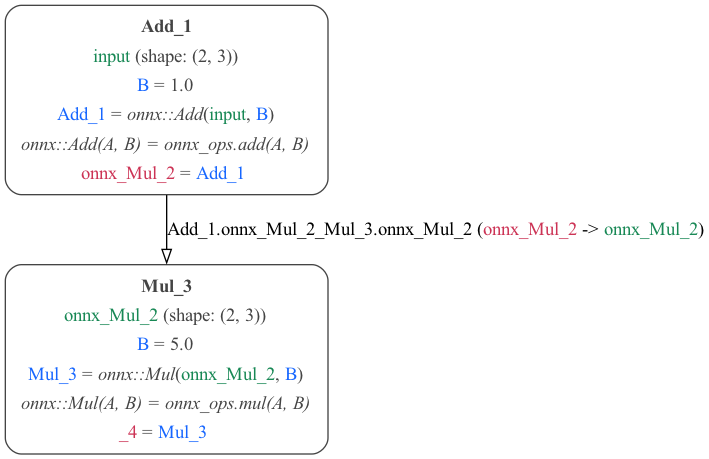
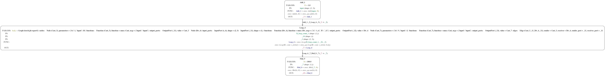

# ONNX MDF Converter

### LeNet5 CNN Model


The ONNX file `examples/convnet.onnx` is a simple LeNet ConvNet model. Code for its training
and ONNX generation is [here](https://github.com/ModECI/MDFTests/blob/onnx_mdf/ONNX/convnet_onnx_example/convnet_onnx_example.ipynb).

To run the converter on the above ONNX ConvNet model:

```
$ onnx-to-mdf examples/convnet.onnx
```

You can see the converted MDF models in [JSON](examples/convnet-mdf.json) and [YAML](examples/convnet-mdf.yml):

### AB Sequential Model - 2 node_specific

[Python source](simple_ab.py) | [JSON](ab.json) | [YAML](ab.yaml)

This is an example of a PyTorch model with 2 nodes.



### ABC Sequential Model with Loop

[Python source](simple_abc.py) | [JSON](abc.json) | [YAML](abc.yaml)

This is an example of a PyTorch model that is implemented in `onnx_mdf/examples/simple_abc.py`. The model code
is very simple:

```python
import torch

class A(torch.nn.Module):
    def forward(self, x):
        return x + 1

@torch.jit.script
def loop_b(x, y):
    for i in range(int(y)):
        x = x / 10
    return x

class B(torch.nn.Module):
    def forward(self, x, y):
        return loop_b(x, y)

class C(torch.nn.Module):
    def forward(self, x):
        return x * 100

class ABC(torch.nn.Module):
    def __init__(self):
        super(ABC, self).__init__()
        self.A = A()
        self.B = B()
        self.C = C()

    def forward(self, x, B_loop_count):
        return self.C(self.B(self.A(x), B_loop_count))
```

This implements a PyTorch model with three modules. The modules process the input sequentially, and the
inner `B` module has a loop construct.




It is exported to ONNX via a combination of tracing and scripting. The resulting ONNX model looks something
like this:


This ONNX IR representation can be converted to MDF. To run this full example, execute this command:

```
$ simple-abc-example
```

You can see the converted MDF models in [JSON](examples/abc-mdf.json) and [YAML](examples/abc-mdf.yml):

### ABCD Branching Conditional Model

[Python source](simple_abcd.py) | [JSON](abcd.json) | [YAML](abcd.yaml)

This is an example of a PyTorch model that have four components (A, B, C, D). We loop over the whole
model 10 iterations. A is executed only on the first iteration, B is executed every iteration, C is
executed every 5 times B is executed, and D is executed every 10 times B is executed. A, B, C, and D are
each simple stateless linear functions. This type of conditional execution specification is common in PsyNeuLink.
The PyTorch code for the model is fairly straightforward:

```python
class Linear(torch.nn.Module):
    def __init__(self, slope=1.0, intercept=0.0):
        super(Linear, self).__init__()
        self.slope = slope
        self.intercept = intercept

    def forward(self, x):
        return self.slope*x + self.intercept


class ABCD(torch.nn.Module):
    def __init__(self, A, B, C, D):
        super(ABCD, self).__init__()
        self.A = A
        self.B = B
        self.C = C
        self.D = D

    def forward(self, x):

        # Since we are implementing conditions that reference the number of calls
        # to A and B, we need to keep track of this.
        num_A_calls = 0
        num_B_calls = 0

        # We need to initialize outputs, torchscript jit complains if c and d
        # are not defined in the FALSE branches of our conditionals.
        a = torch.zeros_like(x)
        b = torch.zeros_like(x)
        c = torch.zeros_like(x)
        d = torch.zeros_like(x)

        for i in range(10):

            # A: pnl.AtNCalls(A, 0),
            if num_A_calls == 0:
                a = self.A(x)
                num_A_calls = num_A_calls + 1

            # B: pnl.Always()
            b = self.B(a)
            num_B_calls = num_B_calls + 1

            # C: pnl.EveryNCalls(B, 5),
            if num_B_calls % 5 == 0:
                c = self.C(b)

            # D: pnl.EveryNCalls(B, 10)
            if num_B_calls % 10 == 0:
                d = self.D(b)

        return c, d
```

The ONNX IR representation of this model is shown below. The small computation sub-graphs
contained in the if and else body attributes are not shown. These are either a simple multiplication and addition or
an identity.


To run this example, execute the following command:

```
$ simple-abcd-example
```

You can see the converted MDF models in [JSON](examples/abcd/abc-mdf.json) and [YAML](examples/abcd/abcd-mdf.yml):
