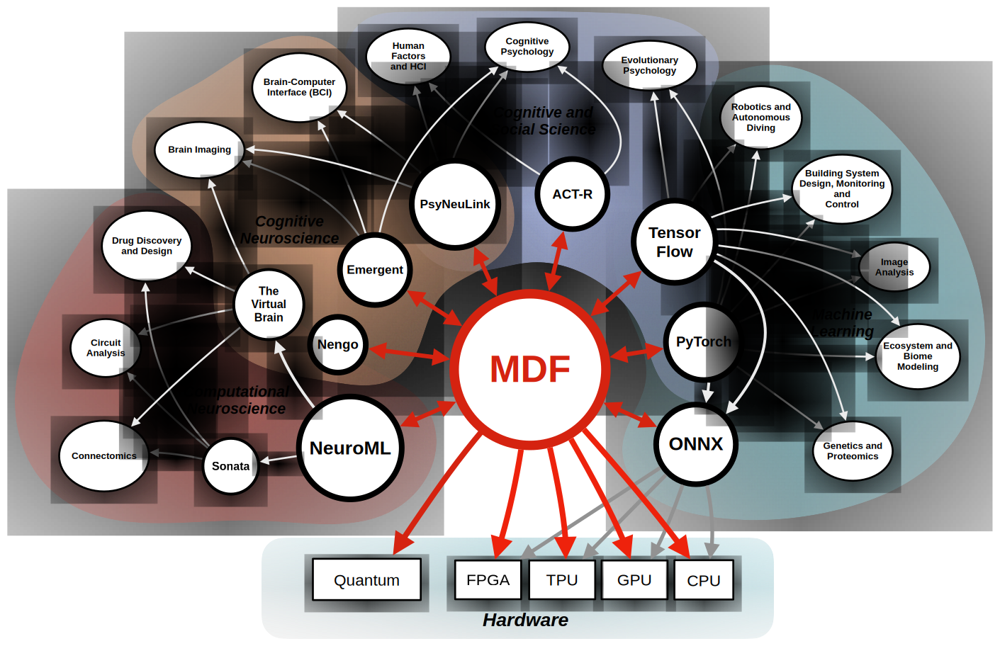

# Examples of MDF files and conversions to target environments

- [MDF files](MDF): A number of Python scripts using the MDF Python API, as well as the JSON and YAML files.
- [NeuroML](NeuroML): Examples of interactions between NeuroML and MDF.
- [ONNX](ONNX): Examples of interactions between MDF and ONNX.
- [PyTorch](PyTorch): Examples of interactions between PyTorch and MDF.
- [PsyNeuLink](PsyNeuLink): Examples of interactions between PsyNeuLink and MDF.
- [WebGME](WebGME): Examples of interactions between WebGME and MDF.
- [ACT-R](ACT-R): Examples of interactions between ACT-R and MDF.
- [Quantum](Quantum): Examples of interactions between MDF and Quantum computing technologies.

# Examples of cross-environment conversions using MDF

- [PyTorch to WebGME](WebGME/examples): Conversion of a PyTorch Inception model to WebGME using MDF.
- [NeuroML to PsyNeuLink](): Conversion of NeuroML models to PsyNeuLink models using MDF.
