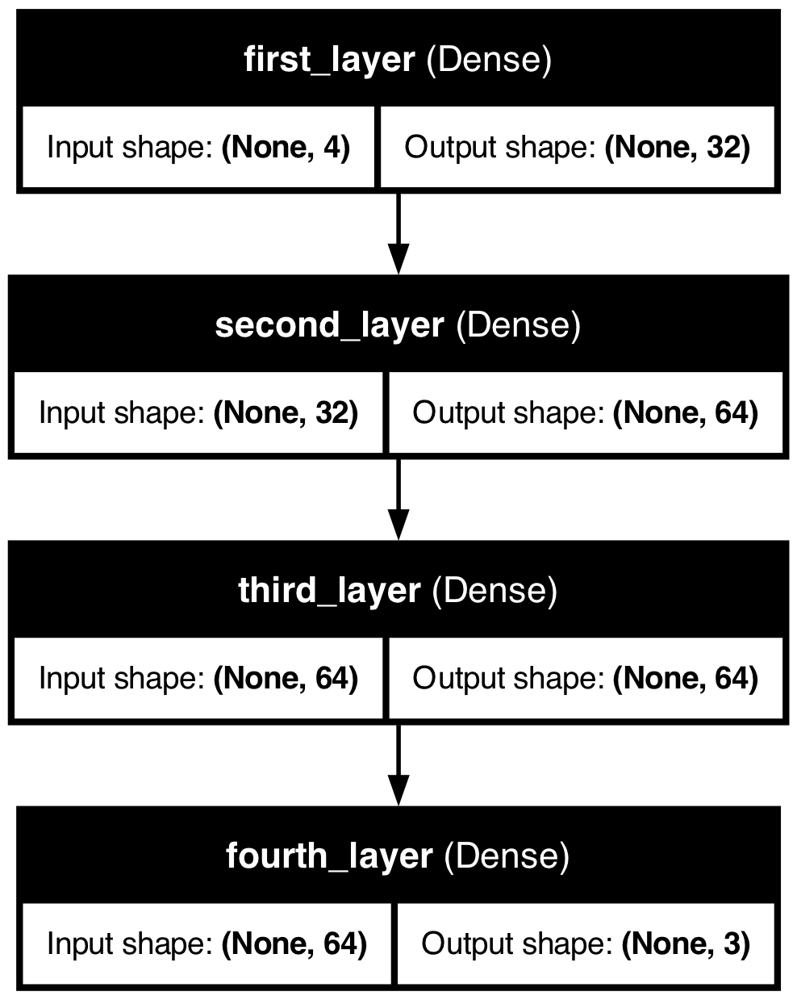

# Keras to MDF example: IRIS dataset

**For more details on Keras and the current state of the Keras->MDF mapping see the [MNIST example](../MNIST).**

This model uses the [IRIS dataset](https://en.wikipedia.org/wiki/Iris_flower_data_set) in the [trained Keras model](keras_model.py) and the MDF equivalent.

### Summarize Model

Below is the summary image of the trained Keras model. We can clearly see the output shape and number of weights in each layer:

### Keras Model

Visualization of the model from Keras:

 

### MDF Model

Graphviz is used to generate visualization for the MDF graph. Below is the visualization of the MDF graph after converting the keras model to MDF.

More detailed graphical representation of the MDF:

##### Netron
Below is the visualization of this model using netron

