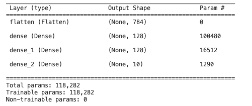
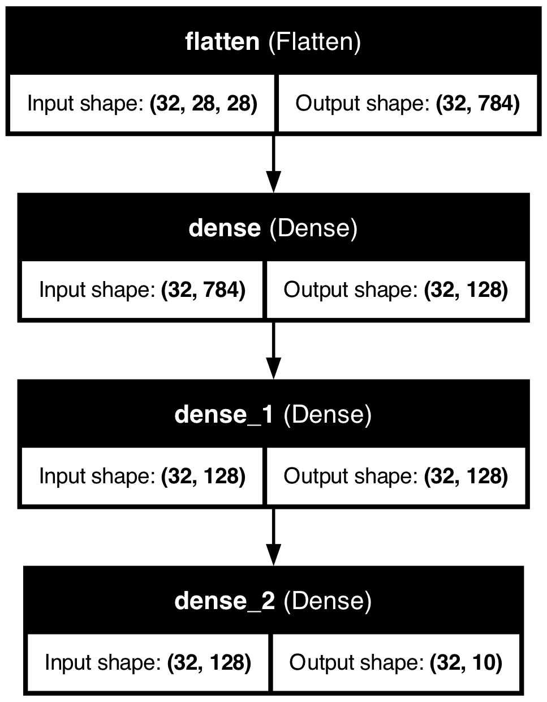

# Keras to MDF example: MNIST

## Keras

[Keras](https://keras.io/) is a high-level API for building and training deep learning models, built on top of TensorFlow, which provides a low-level and flexible platform for numerical computation and data flow programming. We are going to build a simple Machine Learning model using Keras and MNIST data.

## Project objective
The objective of the above model is to classify handwritten digits in the MNIST dataset.
The model takes as input an image of a handwritten digit and outputs a label corresponding to the digit (0-9). The model uses a neural network architecture with a series of dense layers to process the input image and produce a prediction.

The objective is to train the model to accurately predict the correct label for each image in the MNIST dataset. This is achieved by optimizing the model's parameters (weights and biases) using a supervised learning approach, where the model is trained on a labelled training set and evaluated on a separate test set.

The ultimate goal is to produce a model that generalizes well to new, unseen images, and can accurately classify digits with high accuracy. The model is trained using a categorical cross-entropy loss function and the accuracy metric is used to evaluate the performance of the model on the test set.

### MNIST Data
The MNIST (Modified National Institute of Standards and Technology) dataset is a widely used dataset for machine learning and computer vision. It consists of a large collection of greyscale images of handwritten digits (0-9), along with their corresponding labels (the digit in each image). Each image in the MNIST dataset is 28x28 pixels in size, and is represented as a 2-dimensional array of pixel intensities. The reason why we use MNIST to build this model its because of the following:

#### Availability:
The MNIST dataset is widely available and easy to download. You can also easily load it from TensorFlow datasets using the commands below:
```Python
import tensorflow
# access the dataset
mnist = tensorflow.keras.datasets.mnist
# load the dataset
(x_train, y_train), (x_test, y_test) = mnist.load_data()
```
#### Simple and well-defined:
The MNIST dataset consists of simple grayscale images of handwritten digits, and the task of classifying the digit in each image is well-defined and straightforward.
The grayscale images look like the one below


####  Low dimensional:
The MNIST images are 28x28 pixels in size, which is a relatively low dimensional input space compared to more complex image datasets. This makes it easier to train machine learning models and to visualize the results.

####  Clean and preprocessed:
The MNIST dataset has already been preprocessed and cleaned, which saves time and reduces the amount of preprocessing required.

## This Model

#### MNIST Handwritten Digit Recognition

This model uses the Keras library to recognize handwritten digits from the MNIST dataset. The model is built using a Sequential model, with three dense layers and uses the Adam optimizer, sparse categorical crossentropy loss, and accuracy as evaluation metrics.

The model ([keras_model.py](keras_model.py)) is trained for 3 epochs and the final network is saved as [kr_N_model.h5](kr_N_model.h5). The model is then evaluated on the test data, where its accuracy is reported. The model predicts the number for the first test data index, and the actual number is shown using a plot.

### Prerequisites

##### Get Keras installed
Open your command prompt and enter the commands below
```Python
    pip install keras
```
Keras is also integrated in TensorFlow and can be accessed in Python with the commands below
```Python
from tensorflow import keras
```

### Summarize Model
Keras provides a way to summarize a model.

The summary is textual and includes information about:

The layers and their order in the model.
The output shape of each layer.
The number of parameters (weights) in each layer.
The total number of parameters (weights) in the model.
The summary can be created by calling the 'summary()' function on the model that returns a string that in turn can be printed.

Below is the summary image of the trained Keras model. We can clearly see the output shape and number of weights in each layer:




### Visualize Model
Keras also provides a function to create a plot of the network neural network graph that can make more complex models easier to understand.

The plot_model() function in Keras will create a plot of your network. This function takes a few useful arguments:

model: (required) The model that you wish to plot.
to_file: (required) The name of the file to which to save the plot.
show_shapes: (optional, defaults to False) Whether or not to show the output shapes of each layer.
show_layer_names: (optional, defaults to True) Whether or not to show the name for each layer.

To Get the visualization below, you will need to install the following packages
```Python
    pip install pydot
```
[Pydot](https://pypi.org/project/pydot/) is a Python library, also written in Python, that "serves as a graphical interface to Graphviz, an open source graph visualization software

```Python
    pip install pygraphviz
```
[Graphviz](https://graphviz.org/) is open source graph visualization software. Graph visualization is a way of representing structural information as diagrams of abstract graphs and networks

### Keras Model
Keras has a [plot_model](https://keras.io/api/utils/model_plotting_utils/) function that is used to generate the graphical representation of the model's network. Below is the visual representation of the keras model used on the MNIST data set.
<br>

<br>

### MDF Model
The `keras_to_mdf` function is used to convert keras model to MDF. The current implementation of the keras_to_mdf functionality is built upon translating each layer in a keras model into a node in MDF that contains parameters and functions used in the keras layers. In its current state, keras layers with Flatten layer and Dense layers can be automatically translated to MDF.

An example illustrating this conversion in Python is the [keras_to_MDF.py](keras_to_MDF.py) script.
Below is how the keras_to_mdf function was used in the Script
```Python
mdf_model, params_dict = keras_to_mdf(model=model, args=twenty_x_test)
```

The function has two parameters, the first parameter **model** accepts a Keras model as its argument while the second parameter **args** accepts an input tensor or numpy array as its argument. The function returns an mdf model and parameters as its output.

Graphviz is used to generate visualization for the MDF graph. Below is the visualization of the MDF graph after converting the keras model to MDF.


More detailed graphical representation of the MDF:

<p align="center"></p>

##### Netron
Below is the visualization of this model using netron


