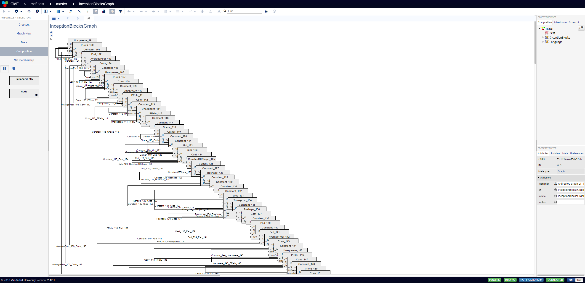

This directory contains examples of models in both MDF and importable GME JSON.
To convert an MDF format JSON to GME use the `bin/instance_converter` script.
For example:

```bash
node bin/instance_converter ../PyTorch/inception.json > examples/gme/Inception.json
```

Below is screenshot taken from the WebGME GUI displaying the converted model:


